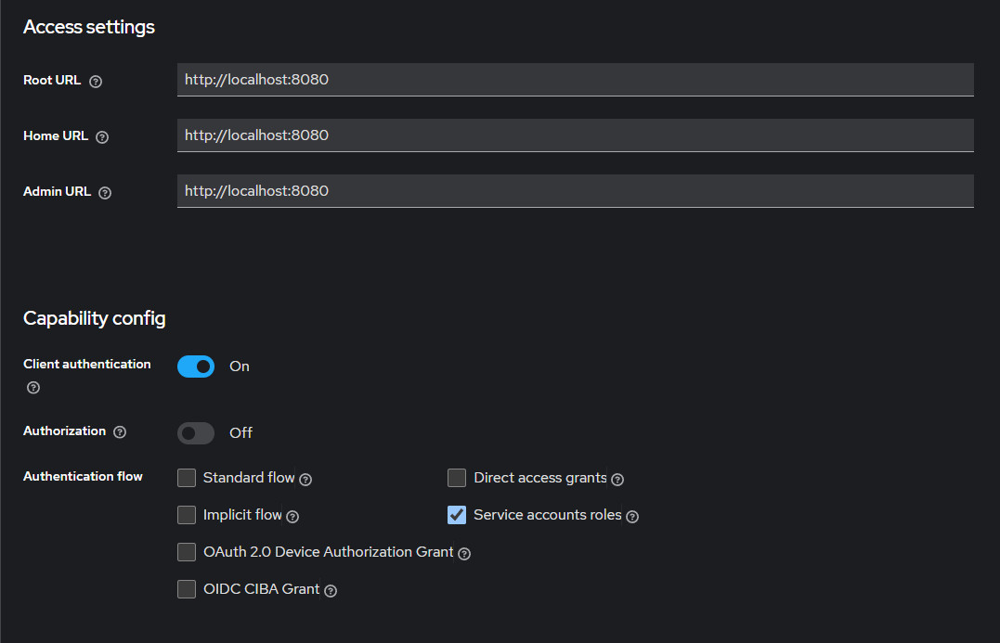

# Gateway Service Microservices Architecture

This project demonstrates a microservices architecture utilizing Spring Boot, Spring Cloud, and KeyCloak for robust security and service discovery. It includes services such as a Gateway Service, Eureka Discovery Service, and multiple back-end services for handling business operations.

## Why KeyCloak?

KeyCloak provides an out-of-the-box solution for handling authentication and authorization in modern applications:

- **Centralized User Management**: Simplifies user management across services with a single point of control.
- **Standards Compliant**: Supports OAuth2, OpenID Connect, and SAML 2.0, ensuring compatibility with modern security protocols.
- **Reduced Implementation Effort**: Offers ready-to-use features that reduce the need to implement complex security features manually.

## Setup and Configuration

### Prerequisites

- Java 17
- Maven
- Docker

### Running KeyCloak with Docker

Start the KeyCloak server using Docker:

```bash
docker run -p 9090:8080 -e KEYCLOAK_ADMIN=admin -e KEYCLOAK_ADMIN_PASSWORD=admin quay.io/keycloak/keycloak:25.0.4 start-dev
```

## Configuring KeyCloak

Follow these steps to set up KeyCloak for handling authentication and authorization across your services:

### 1. Login to KeyCloak
Access the KeyCloak admin console by navigating to `http://localhost:9090`


### 2. Create a New Realm
- In the KeyCloak admin console, create a new realm.
- Customize the settings of the realm according to your security needs, providing a layer of isolation and management.
  
- 


### 3. Create a New Client
- Within your realm, create a new client for your application.
- Configure the client specifics to match the OAuth2 settings required by your microservices.

- 


### 4. Configure Client Settings
- Configure access settings and capabilities for the client.
- Define roles and further access controls that suit your security policies.

- 
  

### 5. Note Security Credentials
- Keep a record of the realm name, client ID, client secret, issuer URI, and token endpoint.
- These credentials will be used to configure your microservices to authenticate and authorize using KeyCloak.

- 


